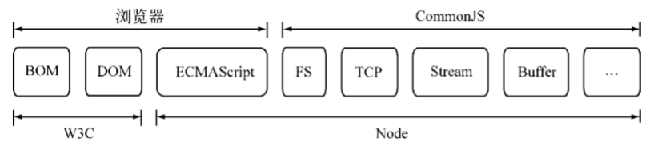

#  深入浅出node 第二章 笔记 从代码结构看待node

### 概述

CommonJS中的大部分规范，为JavaScript开发大型应用程序指明了一条非常好的道路。

CommonJS规范涵盖了模块、二进制、Buffer、字符集编码、IO流、进程环境、文件系统、套接字、单元测试、web服务器网管接口、包管理等。

Node与浏览器，以及W3C组织、CommonJS组织、ECMAScript之间的关系，共同构成一个繁荣的生态系统。

## CommonJS中的模块规范

CommonJS对模块的定义什么简单，主要分为模块引用、模块定义和模块标识三个部分。

#### 模块引用

示例：let math = require('math');

在CommonJS规范中，当前上下文存在require()方法，接受模块标识符，以此引入一个模块的API到当前上下文中。

#### 模块定义

对应引入模块的功能，当前上下文提供了exports对象用于导出当前模块的方法或变量，并且它是唯一导出的出口。

在模块中，还存在一个module对象，它代表模块自身，exports是module的属性。

在node中，一个文件就是一个模块，如下，是将方法挂载在exports对象上作为属性导出的方式：
// math.js
exports.add = function(){
    let sum = 0, i = 0,args = arguments, l = args.length;
    while(i < 1>){
        sum += args[i++];
    }
    return sum;
};

在另一个文件中，我们通过require()方法引入模块后，就能调用定义的属性或方法：
// program.js
let math = require('math');
exports.increment = function(val){
    return math.add(val);
};

#### 模块标识

模块标识其实就是传递给require()方法的参数，它必须是符合小驼峰命名的字符串，或者以.、..开头的相对路径，或者绝对路径，可以没有文件名后缀.js。

CommonJS构建的这套模块导出和导入机制使得程序员不必考虑变量污染和命名空间。

## node对CommonJS模块规范的实现

node在实现中并没有完全按照规范实现，增加了少许自身的特性。

在node中引入模块，需要经历三个步骤：
    1. 路径分析
    2. 文件定位
    3. 编译执行

在node中，模块分为两类：
    1. 核心模块，node提供的模块
    2. 文件模块，程序员自定义的模块

核心模块，在node源代码编译过程中，编译进了二进制执行文件。
在node进程启动时，部分核心模块会直接加载到内存中，对于这些核心模块将没有文件定位和编译执行过程，并且在路径分析时优先选择，这些模块加载速度将会最快。

#### 模块加载过程

浏览器会缓存静态脚本文件以提高性能，node也会一样，对引入过的模块都会进行缓存，以减少二次引用的开销。不同之处，浏览器仅仅缓存文件，node缓存的是编译和执行之后的模块对象。

require()方法对相同模块的二次加载采用缓存优先的方式，无论是核心模块还是文件模块，这是第一优先级，不同之处，核心模块的缓存检查会优先于文件模块的缓存检查。

#### 路径分析和文件定位

require()方法接受一个标识符作为参数，在node中，会对这样一个标识符进行查找。

路径标识符有几种形式，不同的标识符，模块的查找和定位有不同程度的差异。

    1. 核心模块，如http、fs、path等
    2. .或..开始的相对路径为文件模块
    3. 以/开始的绝对路径文件模块
    4. 非路径形式的文件模块，如自定义模块

核心模块标识符查找：
    核心模块的优先级仅次于已缓存模块加载，它的node源代码已经编译为二进制代码，加载速度除缓存之外最快。

如果试图加载一个和核心模块标识符相同的自定义模块，那是不会成功的。

路径形式的文件模块标识符查找：
    以./..和/开始的标识符，这里都被当作文件模块来处理。
    在分析路径模块时，require()方法会将其路径转化为真实路径，并以真实路径作为索引，将编译执行后的结果存放到缓存中，以便二次加载时更快。
    由于文件模块给node指明了确切的文件位置，所以在查找过程中可以节约大量时间，其加载速度慢于核心模块，更加慢于模块缓存。

自定义模块：
    是一种特殊的文件模块，非核心模块，可能是一个文件或者包的形式。
    这类模块的查找的效率是最低的一种查找方式。

模块路径：
    node在定位具体文件模块时制定的查找策略，具体表现是一个由路径组成的数组。
    关于路径的[生成规则](../code/patharr.js)
    它的生成方式与JS的原型链或作用域链的查找方式十分相似。
    在加载的过程中，node会逐个尝试模块路径中的路径，直到找到目标文件为止。
    可以看出，当前文件的路径越深，模块查找耗时越多，这是自定义模块的加载速度是最慢的原因。

文件定位：
    

Node